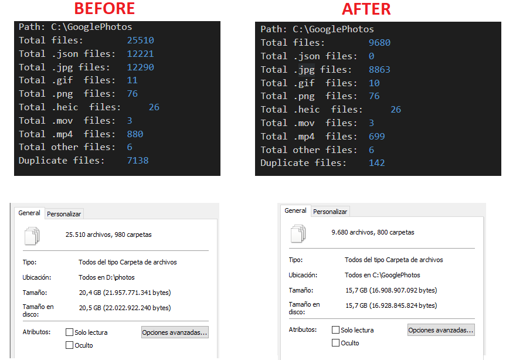

# CleanGooglePhotosTakeOut
When you use [Take Out](https://takeout.google.com/) to downlad all photos from Google Photos:
- A folder yyyy-mm-dd for each day with photos.
- A JSON file data for each photo.
- A lot of pictures duplicates, in your date folder and album folder. 

¡It's impossible reorganize all this files!

**Solution:** this program.

## Behavior this program
- Remove all json files.
- Check duplicate files and keep files of album folder. Remove in day folders.
- Remove empty folders
- Fix extension files 
- Fix files with extension ending in numbers, changing to .jpg.

## How to use?
You need dotnet core 3.1 sdk to run. You can find it [here](https://dotnet.microsoft.com/download/dotnet-core/3.1)

**Change the path**
```
var pathToClean = @"C:\GooglePhotos";  
```
Execute: 
`dotnet run`

View the log file generate with the result.

## Sample results

